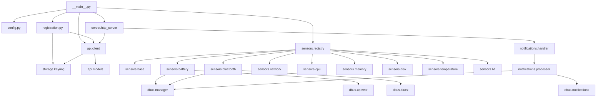

# Home Assistant Linux Companion Internal Design

## Overview

The Home Assistant Linux Companion (halinuxcompanion) is a Python application that bridges Linux desktop systems with Home Assistant through the mobile app API. It provides sensor data from the Linux system to Home Assistant and displays Home Assistant notifications on the Linux desktop.

## Core Architecture

### Module Structure

The application follows a modular architecture with clear separation of concerns:

```
halinuxcompanion/
├── __main__.py              # Entry point
├── config.py                # Configuration management
├── registration.py          # OAuth & device registration
├── api/
│   ├── __init__.py
│   ├── client.py            # Home Assistant Mobile App API client
│   ├── models.py            # Pydantic models for API data
│   └── encryption.py        # Sodium encryption (future)
├── sensors/
│   ├── __init__.py
│   ├── base.py              # Base sensor classes
│   ├── registry.py          # Sensor registry & lifecycle
│   ├── battery.py           # Battery sensors (UPower)
│   ├── bluetooth.py         # Bluetooth sensors (BlueZ)
│   ├── network.py           # Network interface sensors
│   ├── cpu.py               # CPU usage, frequency, load
│   ├── memory.py            # RAM and swap usage
│   ├── disk.py              # Disk usage per partition
│   ├── temperature.py       # Temperature sensors
│   ├── lid.py               # Lid open/closed sensor
│   └── activity.py          # Screen lock/activity sensor
├── notifications/
│   ├── __init__.py
│   ├── handler.py           # Notification webhook handler
│   ├── dbus_client.py       # DBus notification sender & action listener
│   └── processor.py         # Notification processing logic
├── dbus/
│   ├── __init__.py
│   ├── manager.py           # DBus connection management
│   ├── upower.py            # UPower interface
│   ├── bluez.py             # BlueZ interface
│   ├── notifications.py     # FreeDesktop notifications
│   ├── geoclue.py           # GeoClue2 location service
│   ├── screensaver.py       # ScreenSaver interfaces
│   └── login1.py            # systemd-logind session interface
├── storage/
│   ├── __init__.py
│   ├── keyring.py           # Secure credential storage
│   └── state.py             # Sensor states, notification mappings, rate limits
└── http_server.py           # HTTP server for all webhook endpoints
```

### Component Dependencies



## Initialization Sequence

1. **Configuration Loading**
   - Load from XDG config directory (`~/.config/halinuxcompanion/config.toml`)
   - Validate configuration schema
   - Apply defaults for missing values

2. **Storage Initialization**
   - Initialize keyring connection for secure credential storage
   - Check for existing registration data in keyring (service: "halinuxcompanion", key: "registration")
   - Load application state from `~/.local/share/halinuxcompanion/state.json` if exists

3. **Registration Check**
   - If no registration exists:
     - If running from terminal: initiate OAuth flow
     - If not from terminal: exit with error
   - If registration exists: validate it's still valid

4. **DBus Connection**
   - Connect to session bus
   - Initialize DBus manager
   - Check for required services based on enabled sensors

5. **Sensor Initialization**
   - Create sensor instances based on configuration
   - Register sensors with Home Assistant
   - Start sensor update loops/listeners

6. **Webhook Server**
   - Start single HTTP server on configured port (default: 8123)
   - Handle the webhook endpoint: `/api/webhook/<webhook_id>`
   - This is the ONLY endpoint - all HA->app communication uses this single webhook
   - Connect to DBus notification service

7. **Main Loop**
   - Send initial sensor states
   - Enter event loop for sensor updates and notifications

## Sensor Update Handling

### Push-based Updates (Preferred)

For sensors that support change notifications:

1. **Battery (UPower)**
   - Subscribe to `PropertiesChanged` signal on UPower devices
   - Update immediately when battery state/level changes
   - Debounce rapid changes (e.g., during charging)

2. **Bluetooth (BlueZ)**
   - Subscribe to `PropertiesChanged` on adapter and devices
   - Monitor device connection/disconnection
   - Track RSSI changes for connected devices

3. **Network Interfaces**
   - Monitor netlink events for interface state changes
   - Use `pyroute2` or similar for network monitoring
   - Update on IP address changes, link up/down

### Poll-based Updates

For sensors without push notifications:

1. **System Sensors** (CPU, RAM, disk)
   - Poll at configurable intervals (default: 60s)
   - Use exponential backoff if sensor reading fails
   - Report unavailable if repeated failures

2. **Temperature Sensors**
   - Poll at longer intervals (default: 300s) to avoid excessive filesystem access
   - Group updates to reduce API calls

### Update Batching

- Collect updates in a queue with a short delay (100-500ms)
- Batch multiple sensor updates into single API call
- Implement retry with exponential backoff for failed requests
- Cancel retries if a newer update for the same sensor arrives

## Notification System Design

### Receiving Notifications

1. **HTTP Webhook Endpoint**
   - The single webhook server (running on localhost, default port 8123) handles notification webhooks
   - Accept POST requests to `/api/webhook/<webhook_id>`
   - Validate webhook ID matches registration
   - Parse notification payload and pass to notification handler

2. **Notification Processing**
   ```python
   class NotificationProcessor:
       def process(self, notification: HANotification):
           # Extract notification data
           # Map HA format to DBus format
           # Handle special features (actions, icons, etc.)
           # Send via DBus
   ```

### DBus Notification Features

Map Home Assistant notification features to FreeDesktop.org spec:

| HA Feature | DBus Mapping | Notes |
|------------|--------------|-------|
| title | summary | Direct mapping |
| message | body | Map HA HTML to DBus markup (see below) |
| tag | replaces_id | Use for notification replacement |
| actions | actions array | Map to DBus action format |
| icon_url | - | Not supported in V1 (future: download & cache) |
| importance | hint: urgency | low=0, normal=1, critical=2 |
| timeout | expire_timeout | Convert to milliseconds (-1 for default) |
| persistent | hint: resident | True = never auto-expire |
| image | - | Not supported in V1 (future: download & cache) |
| color | hint: category | Map to appropriate category if possible |

#### Supported Features from Companion App:
- **Basic**: title, message, clear notification by tag
- **Actions**: URL opening (with validation), HA event callbacks
- **Attachments**: Not in V1 (future: images/audio/video)
- **Notification cleared**: Report back via NotificationClosed signal
- **Notification received**: Fire event when notification displayed
- **Commands**: clear_notification, request_location_update, command_update_sensors

#### Not Supported (DBus limitations):
- Grouping (Android-specific)
- Progress bars
- Chronometer
- Text input in actions
- Most command_* features (mobile-specific)

### HTML to DBus Markup Mapping

Home Assistant supports HTML formatting, but DBus notifications use a more limited markup subset:

| HA HTML | DBus Markup | Notes |
|---------|-------------|-------|
| `<b>`, `<strong>` | `<b>` | Bold text |
| `<i>`, `<em>` | `<i>` | Italic text |
| `<u>` | `<u>` | Underline |
| `<br>`, `<br/>` | Newline | Convert to `\n` |
| `<span style="...">` | Strip | DBus doesn't support inline styles |
| `<a href="...">` | `<a href="...">` | If server supports hyperlinks |
| Other HTML tags | Strip | Remove unsupported tags but keep content |

Note: DBus also supports `` tags but requires local file paths, so remote images from HA would need to be downloaded first.

### Action Handling

1. **DBus Signal Monitoring**
   - Listen for `ActionInvoked` signal
   - Map action ID back to HA action
   - Execute appropriate response

2. **Action Types**
   - **URI Actions**: Open in default browser (validate URL safety)
   - **Service Actions**: Call HA service via webhook
   - **Command Actions**: Execute whitelisted local commands
   - **Event Actions**: Fire events to HA

3. **Notification Lifecycle**
   - Track notification IDs for mapping
   - Handle `NotificationClosed` signal
   - Report dismissal back to HA if requested

## Registration and Storage

### OAuth Flow

1. Start local HTTP server for OAuth callback
2. Generate PKCE challenge
3. Open browser to HA OAuth endpoint
4. Handle callback, exchange code for token
5. Register device with mobile_app integration
6. Store webhook_id securely, discard OAuth token

### Secure Storage

```python
from pydantic import BaseModel

class Registration(BaseModel):
    webhook_id: str
    webhook_secret: str | None = None  # For encryption
    instance_url: str
    cloudhook_url: str | None = None
    remote_ui_url: str | None = None

    def save(self):
        # Store in keyring
        keyring.set_password("halinuxcompanion", "registration",
                            self.model_dump_json())
```

### State Persistence

Non-sensitive state stored in `~/.local/share/halinuxcompanion/state.json`:
- Sensor enabled/disabled states (which sensors user has toggled on/off)
- Last sensor update timestamps (for retry/backoff logic)
- Notification ID mappings (DBus ID <-> HA tag mapping for replacements)

## DBus Service Management

Use `dependency-injector` for simplifying construction of objects with complex dependencies -
for example, to inject system & session buses into sensor classes.

### Signal Subscription Lifecycle

* Subscribe to signals when service becomes available
* Handle service disconnect gracefully
* Re-subscribe when service returns
* Clean up subscriptions on shutdown

* Reference:
  * <references/dbus-fast/src/dbus_fast/aio/proxy_object.py>
    * dbus-fast signal subscription patterns
  * <references/dbus-fast/src/dbus_fast/message_bus.py>
    * dbus-fast message bus connection management, `NameOwnerChanged` handling

Example sensor interface sketch:

```python
class BatterySensor(BaseSensor):
    def __init__(self, system_bus: MessageBus):
        self.system_bus = system_bus

    async def start(self):
        # Connect to system bus.
        #
        # List existing UPower batteries.
        #
        # Subscribe to PropertiesChanged on service org.freedesktop.UPower,
        # interface org.freedesktop.UPower.Device
        # on object path /org/freedesktop/UPower/devices/battery_BAT0
        #
        # Read off initial state.
        #
        # Theoretically we should not be persisting proxies across - service
        # name owner changes may mean changes in introspection and may technically
        # require re-introspection. We do not account for that. Well-known
        # APIs like 'org.mpris.MediaPlayer2' include the major version number
        # in the API name itself. SImilar patterns often used for object paths,
        # well-known service names etc.
        #
        # We do not handle services themselves disappearing. If bluetooth devices
        # are enabled, we treat BlueZ as a hard dependency. If BlueZ service were
        # to disappear, we do not catch it - signals will just not arrive and we
        # may crash if we try to read it without a signal trigger.

    async def stop(self):
        """Unsubscribe from signals and clean up resources."""

    async def _on_battery_properties_changed(self):
        ...

    async def _on_battery_changed(self, interface: str, changed: dict, invalidated: list):
        """Handle battery property changes."""
```

## Error Handling and Resilience

### Sensor Failures

- Individual sensor failures don't crash the app
- Failed sensors report "unavailable" state
- Retry with exponential backoff
- Log errors appropriately

### Network Failures

- Queue updates during network outage
- Cloudhook not supported in V1
- Implement circuit breaker pattern
- Notify user of persistent failures

### DBus Service Failures

- Gracefully handle missing optional services
- Disable affected sensors
- Periodically check for service availability
- Log warnings but continue operation

## Configuration Schema

```toml
[general]
# Device information
device_name = "My Linux PC"
manufacturer = "Dell"
model = "XPS 13"

[homeassistant]
# Instance URL (set during registration)
instance_url = "https://home.example.com"

[sensors]
# Global sensor settings
update_interval_seconds = 60
batch_delay_seconds = 0.5

[sensors.battery]
enabled = true
# No config needed, uses UPower

[sensors.bluetooth]
enabled = true
# Whitelist of device MACs to track
devices = [
    "AA:BB:CC:DD:EE:FF",
    "11:22:33:44:55:66"
]

[sensors.network]
enabled = true
# Interfaces to monitor
interfaces = ["eth0", "wlan0"]
# Privacy settings
show_ipv4 = true
show_ipv6 = false
show_mac = false

[sensors.cpu]
enabled = true

[sensors.memory]
enabled = true

[sensors.disk]
enabled = true
# Partitions to monitor
partitions = ["/", "/home"]

[sensors.temperature]
enabled = true
# Auto-discover or explicit list
sensors = []  # Empty = auto

[notifications]
enabled = true
# HTTP server settings
host = "127.0.0.1"
port = 8123

[notifications.actions]
# Command whitelist
commands = {
    "shutdown" = "systemctl poweroff",
    "lock" = "loginctl lock-session"
}
# URL patterns to allow
allowed_urls = [
    "https://*.home-assistant.io/*",
    "https://home.example.com/*"
]
```

## Security Considerations

1. **Webhook Authentication**
   - Outgoing: We send requests to HA using webhook_id in the URL path
   - Incoming: HA sends notifications with push_token we provided during registration
   - Verify push_token on incoming notification requests
   - No OAuth token stored after registration

2. **Command Execution**
   - Strict whitelist for allowed commands
   - No shell expansion or user input in commands
   - Commands defined in config only

3. **URL Validation**
   - Whitelist allowed URL patterns
   - Prevent navigation to local files
   - Block potentially dangerous schemes

4. **DBus Security**
   - Use session bus for desktop services (notifications, screen lock)
   - Use system bus for hardware services (UPower, BlueZ) - read-only access
   - No privileged operations requiring PolicyKit
   - Only monitor/read from system bus services, never modify

## Areas of Uncertainty

1. **Activity/Lock Detection**
   - Use multiple DBus services for compatibility:
     - `org.freedesktop.login1` - systemd session state (see references/systemd/man/org.freedesktop.login1.xml)
     - `org.freedesktop.ScreenSaver` - generic screensaver
     - `org.gnome.ScreenSaver` - GNOME-specific
   - Monitor session state changes and screensaver activation
   - Need to determine best approach for unified activity sensor

2. **Sensor Discovery**
   - Hardware sensors vary greatly between systems
   - Need robust detection and fallback logic
   - May need hwmon parsing for temperatures

## Testing Strategy

1. **Unit Tests**
   - Mock DBus services
   - Test sensor value parsing
   - Validate API request/response handling

2. **Integration Tests**
   - Use isolated DBus daemon for each test
   - Test DBus components with real multiprocess setup
   - Avoid dbus-fast's same-process limitations
   - Example test setup:
   ```python
   class IsolatedDBusDaemon:
       """Manages an isolated DBus daemon for testing."""
       def start(self) -> str:
           # Start dbus-daemon with custom config
           # Return the bus address

   async def test_with_isolated_bus():
       async with IsolatedDBusDaemon() as daemon:
           bus = await MessageBus(bus_address=daemon.address).connect()
           # Run tests with isolated bus
   ```
   - Use Home Assistant test instance for API tests
   - Verify notification flow end-to-end

3. **Hardware Variation**
   - Test on systems without optional hardware
   - Ensure graceful degradation
   - Document minimum requirements

4. **DBus-specific Testing Notes**
   - dbus-fast cannot handle service and client in same process/event loop
   - Use subprocess for test services to avoid introspection timeouts
   - Message handlers must return None to avoid blocking dbus-fast internals
   - See `scratch/dbus/FINDINGS.md` for discovered gotchas

## Future Enhancements (Post-v1)

1. **Encryption Support**
   - Implement libsodium encryption
   - Add `enable_encryption` webhook call
   - Secure all webhook communications

2. **Dynamic Sensor Management**
   - Support HA-initiated enable/disable
   - Periodically call `get_config` webhook to fetch HA configuration
   - Sync sensor states with HA based on response

3. **Zeroconf Discovery**
   - Publish `_hass-mobile-app._tcp.local.` service to trigger automatic mobile_app integration loading (ref: native-app-integration/setup.md)
   - Browse for `_home-assistant._tcp.local.` to discover HA instances
   - Simplify initial setup by auto-discovering local HA instance

4. **Location Updates**
   - Integrate with GeoClue2 DBus API
   - Support GPS and network location providers
   - Implement privacy controls and accuracy settings
   - Send via update_location webhook (not sensor)

5. **Service Actions**
   - Add UI for triggering HA services
   - System tray integration
   - Keyboard shortcuts

6. **WebSocket Support**
   - Not implementing in V1 (per SPEC.md)
   - Current design uses HTTP webhooks only
   - Could be added in future for lower latency

7. **Icon Handling for Notifications**
   - Need to download and cache remote icons
   - Handle icon format conversions
   - Determine optimal cache strategy

8. **Cloudhook Support** (+ fallbacks)
